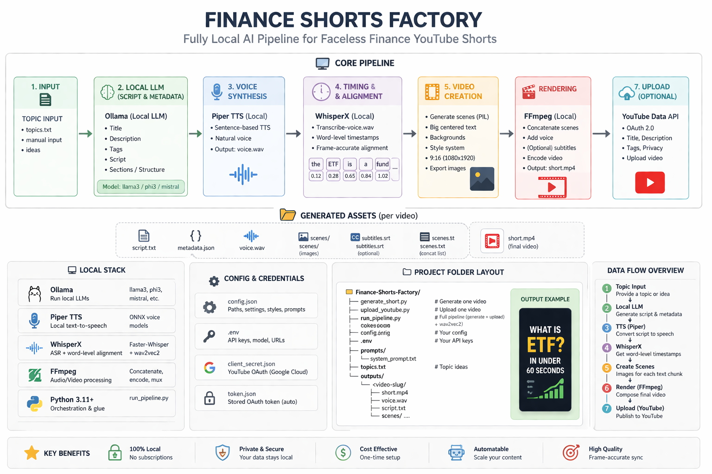

# 🎬 Finance Shorts Factory

> A fully local, no-subscription pipeline for creating **faceless English YouTube Shorts** about beginner finance topics.


---

## ✨ Features

- 🧠 Generate title, description, tags, and script with a **local LLM** via Ollama
- 🎙 Convert script to natural voice with **Piper**
- 🎨 Create **vertical TikTok / Shorts style scenes** with big centered text
- 🎬 Render shorts locally with **FFmpeg**
- 📤 Upload videos to YouTube with the **official OAuth**
- 🔒 Runs locally, no recurring subscription required

---

## 🧱 Stack

- **Python**
- **Ollama**
- **Piper**
- **FFmpeg**
- **YouTube Data API v3**

---

## Architecture



---

## 📂 Project Structure

```text
finance_shorts_factory/
│
├── generate_short.py          # Generate one complete video locally
├── upload_youtube.py          # Upload an existing rendered video
├── run_pipeline.py            # Generate + optional upload
│
├── prompts/
│   └── system_prompt.txt      # Script quality + style prompt
│
├── config.json                # Local paths (Piper, FFmpeg, client_secret.json)
├── .env                       # Ollama config
├── topics.txt                 # Optional topic list for batch workflows
│
├── outputs/
│   └── <video-slug>/
│       ├── script.txt
│       ├── metadata.json
│       ├── voice.wav
│       ├── scenes/
│       ├── scenes.txt
│       └── short.mp4          # Final rendered video
│
└── README.md
```

---

## 🚀 Quick Start

### 1. Create virtual environment

```powershell
py -3 -m venv .venv
.\.venv\Scripts\Activate.ps1
```

If PowerShell blocks script execution:

```powershell
Set-ExecutionPolicy -Scope Process -ExecutionPolicy Bypass
```

### 2. Install dependencies

```powershell
pip install -r requirements.txt
```

### 3. Create config files

```powershell
copy config.example.json config.json
copy .env.example .env
```

### 4. Install required tools

Make sure these work in terminal:

```powershell
ffmpeg -version
ollama --version
```

### 5. Pull a local model in Ollama

```powershell
ollama pull llama3.1:8b
```

### 6. Generate your first short

```powershell
python run_pipeline.py --topic "What an ETF is in under 60 seconds"
```

---

## 🎬 Core Commands

### Generate one video

```powershell
python run_pipeline.py --topic "What an ETF is in under 60 seconds"
```

### Generate + upload as private

```powershell
python run_pipeline.py --topic "How inflation quietly destroys cash savings" --upload --privacy private
```

### Upload an already rendered video

```powershell
python upload_youtube.py --video "outputs/<slug>/short.mp4" --metadata "outputs/<slug>/metadata.json" --privacy private
```

---

## 🎙 Voice Setup

Recommended voices:

- `en_US-lessac-high`
- `en_US-amy-medium`

Example `config.json` paths:

```json
{
  "paths": {
    "piper_exe": "C:/AI/piper/piper.exe",
    "voice_model": "C:/AI/piper/voices/en_US-lessac-high.onnx",
    "voice_config": "C:/AI/piper/voices/en_US-lessac-high.onnx.json",
    "ffmpeg": "ffmpeg",
    "ffprobe": "ffprobe",
    "client_secret_json": "client_secret.json"
  }
}
```

---

## 🎨 Design Notes

Current design system includes:

- **BIG centered text**
- automatic font scaling
- smart text wrapping
- safe margins for Shorts UI
- dark readability panel
- finance-themed gradient backgrounds

---

## 🧠 Script Notes

Scripts are optimized for:

- 70–95 words
- hook-first structure
- one idea per video
- human tone
- beginner-friendly explanations

Typical structure:

```text
Hook
Explanation
Example
Why it matters
CTA
```

---

## 📤 YouTube OAuth Setup

### Before first upload

1. Create a Google Cloud project
2. Enable **YouTube Data API v3**
3. Create OAuth Client → **Desktop App**
4. Download the credentials file
5. Rename it to:

```text
client_secret.json
```

6. Place it in the project root

### First upload

```powershell
python run_pipeline.py --topic "ETF basics" --upload --privacy private
```

This will:

- open a browser window
- ask you to log in
- create a local `token.json`

After that, future uploads will reuse the saved token.

---

## 🔒 Recommended Workflow

For production use:

1. Generate videos as **private**
2. Review:
   - script
   - voice
   - visual clarity
   - finance claims
3. Publish manually first
4. Automate later once quality is stable

---

## 📈 Production Strategy

Recommended operating model:

- create **5–10 shorts per day**
- keep one tight niche
- test hooks aggressively
- review retention visually
- improve pacing and readability over time

---

## ⚠️ Quality Rule

Do **not** mass-upload:

- repetitive content
- low-value scripts
- near-duplicate videos
- lightly modified spam variations

Focus on:

- clarity
- usefulness
- retention
- credibility

---

## 🛠 Future Upgrades

Planned / optional improvements:

- batch topic generator
- background music + sound mixing
- keyword highlighting
- motion effects
- auto scheduling
- thumbnail generator

---

## ✅ Status

You now have a **fully local AI YouTube Shorts factory** for finance content.

